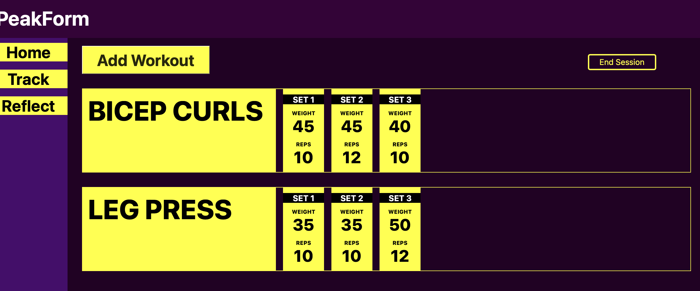

# PeakForm

## Overview
PeakForm is a JavaScript project designed to help users track and analyze their peak performance in various activities. 

This project isn't completed, but has many of the core features in place.

## Screenshots

Here are some screenshots of PeakForm:





## Features
- Track performance metrics
- Analyze trends over time

Coming soon...
- Track workouts across time
- Analyze more complex metrics

## Technologies Used
- HTML, CSS, Javascript

## Installation
To get started with PeakForm, follow these steps:

1. Clone the repository:
    ```bash
    git clone https://github.com/yourusername/PeakForm.git
    ```
2. Navigate to the project directory:
    ```bash
    cd PeakForm
    ```
3. Go Live!

## Usage
To start using PeakForm, just click Go Live, or open the directory in your browser!

## License
This project is licensed under the MIT License. See the [LICENSE](LICENSE) file for details.

## Contact
For any questions or feedback, please contact me at [defford@gmail.com](mailto:defford@gmail.com).
